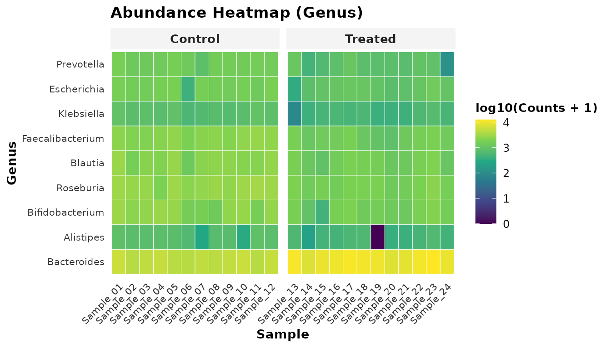

# Bioconductor Interoperability: Integrating tidybiome with TreeSummarizedExperiment and mia

## Abstract

The Bioconductor ecosystem has coalesced around `SummarizedExperiment`
and `TreeSummarizedExperiment` (Huang et al., 2021) as foundational data
structures for multi-assay high-throughput genomics and metagenomics.
While `TreeSummarizedExperiment` (TreeSE) and downstream analytical
packages like `mia` provide rigorous S4 containerization, exploring,
wrangling, and visualizing microbiome datasets often requires navigating
multi-layered slot accessors that conflict with tidy data principles.

`tidybiome` bridges the gap between Bioconductor S4 rigor and
`tidyverse` fluidity. It provides bidirectional, lossless conversion
between `tidy_microbiome` and `TreeSummarizedExperiment` objects,
enabling researchers to seamlessly interchange between `mia` pipelines
and `tidybiome`’s modern compositional tools (Robust CLR, CAFT zero-cell
consensus differential abundance, distance-based redundancy analysis,
and microbial co-occurrence networks).

------------------------------------------------------------------------

## 1. Introduction

Bioconductor is the gold standard for reproducible computational
biology. In microbiome research: - **`TreeSummarizedExperiment`**
extends `SingleCellExperiment` / `SummarizedExperiment` to store assay
matrices alongside row/column hierarchical phylogenetic trees
(`rowTree`, `colTree`). - **`mia`** (Microbiome Analysis) provides an
extensive collection of functions operating natively on
`TreeSummarizedExperiment` containers.

However, many exploratory analyses, data cleaning steps, and publication
visualizations benefit from tidy data representations where samples
behave as tibble observations and `dplyr` verbs operate intuitively.

`tidybiome` was built to complement, rather than compete with, the
Bioconductor ecosystem.

    ┌────────────────────────────────────────┐             ┌────────────────────────────────────────┐
    │     TreeSummarizedExperiment (S4)      │             │        tidy_microbiome (S3)            │
    │                                        │  to_tidy    │                                        │
    │  • assays: counts, relabundance        │ ──────────> │  • Inherits from tbl_df (sample meta)  │
    │  • colData: sample covariates          │             │  • S3 bracket subsetting: tb[i, j]     │
    │  • rowData: taxonomic annotations      │ <────────── │  • attr(tb, "assays"): matrices        │
    │  • rowTree: phylogenetic ape::phylo    │   to_tse    │  • attr(tb, "tax_table"): tibble       │
    │                                        │             │  • attr(tb, "phy_tree"): ape::phylo    │
    └────────────────────────────────────────┘             └────────────────────────────────────────┘

------------------------------------------------------------------------

## 2. Installation & Loading

To install `tidybiome` along with core Bioconductor dependencies:

``` r

if (!requireNamespace("BiocManager", quietly = TRUE))
    install.packages("BiocManager")

# Bioconductor foundation packages
BiocManager::install(c("SummarizedExperiment", "TreeSummarizedExperiment", "mia"))

# Install tidybiome
devtools::install_github("mladen5000/tidybiome")
```

``` r

library(tidybiome)
library(dplyr)
library(ggplot2)

data("gut_microbiome", package = "tidybiome")
gut_microbiome
#> ── tidy_microbiome [24 samples × 40 taxa] ──────────── 
#>   • Assays:         counts 
#>   • Taxonomy ranks: Kingdom > Phylum > Genus 
#>   • Tree:           None 
#> ── Sample Metadata ─────────────────────────────────── 
#> # A tibble: 24 × 5
#>    sample_id treatment diet        age depth
#>    <chr>     <fct>     <fct>     <dbl> <dbl>
#>  1 Sample_01 Control   Standard     54 22212
#>  2 Sample_02 Control   HighFiber    34 17287
#>  3 Sample_03 Control   Standard     44 18716
#>  4 Sample_04 Control   HighFiber    46 18906
#>  5 Sample_05 Control   Standard     44 20561
#>  6 Sample_06 Control   HighFiber    39 14289
#>  7 Sample_07 Control   Standard     55 17019
#>  8 Sample_08 Control   HighFiber    39 18048
#>  9 Sample_09 Control   Standard     60 19046
#> 10 Sample_10 Control   HighFiber    39 20230
#> # ℹ 14 more rows
```

------------------------------------------------------------------------

## 3. Two-Way Conversion: `TreeSummarizedExperiment` & `tidybiome`

#### 3.1 Exporting to `TreeSummarizedExperiment` (`to_tse`)

When collaborating with researchers whose workflows rely on Bioconductor
packages (`mia`, `scater`, `bluster`), you can convert any
`tidy_microbiome` object directly into a `TreeSummarizedExperiment`:

``` r

# Convert to TreeSummarizedExperiment
tse <- to_tse(gut_microbiome)
tse
#> class: TreeSummarizedExperiment 
#> dim: 40 24 
#> metadata(0):
#> assays(1): counts
#> rownames(40): ASV01 ASV02 ... ASV39 ASV40
#> rowData names(3): Kingdom Phylum Genus
#> colnames(24): Sample_01 Sample_02 ... Sample_23 Sample_24
#> colData names(4): treatment diet age depth
#> reducedDimNames(0):
#> mainExpName: NULL
#> altExpNames(0):
#> rowLinks: NULL
#> rowTree: NULL
#> colLinks: NULL
#> colTree: NULL
```

All metadata columns are placed into `colData(tse)`, taxonomy ranks into
`rowData(tse)`, and all registered count/transformed assays into
`assays(tse)`.

#### 3.2 Importing from `TreeSummarizedExperiment` (`as_tidybiome`)

Conversely, when receiving a `TreeSummarizedExperiment` or
`SummarizedExperiment` object from a Bioconductor pipeline or public
repository (e.g. `curatedMetagenomicData`), convert it into
`tidy_microbiome` with a single command:

``` r

# Convert TreeSE or SummarizedExperiment back to tidy_microbiome
tb_restored <- as_tidybiome(tse)
tb_restored
```

The resulting `tb_restored` is immediately ready for native `dplyr`
filtering, compositional modeling, and publication visualizations.

------------------------------------------------------------------------

## 4. A Hybrid Bioconductor Workflow

Combining Bioconductor’s `mia` container storage with `tidybiome`’s
statistical tools provides the best of both worlds:

#### 4.1 Step 1: Quality Control and Normalization with `tidybiome`

Filter low-depth samples with
[`dplyr::filter`](https://dplyr.tidyverse.org/reference/filter.html) and
apply zero-safe Robust CLR without pseudocount distortion:

``` r

# Tidy filtering and modern rCLR transformation
gut_clean <- gut_microbiome |>
  filter(depth > 12000) |>
  transform_abundance(method = "rclr") |>
  transform_abundance(method = "gmpr")

gut_clean
#> ── tidy_microbiome [24 samples × 40 taxa] ──────────── 
#>   • Assays:         counts, rclr, gmpr 
#>   • Taxonomy ranks: Kingdom > Phylum > Genus 
#>   • Tree:           None 
#> ── Sample Metadata ─────────────────────────────────── 
#> # A tibble: 24 × 5
#>    sample_id treatment diet        age depth
#>    <chr>     <fct>     <fct>     <dbl> <dbl>
#>  1 Sample_01 Control   Standard     54 22212
#>  2 Sample_02 Control   HighFiber    34 17287
#>  3 Sample_03 Control   Standard     44 18716
#>  4 Sample_04 Control   HighFiber    46 18906
#>  5 Sample_05 Control   Standard     44 20561
#>  6 Sample_06 Control   HighFiber    39 14289
#>  7 Sample_07 Control   Standard     55 17019
#>  8 Sample_08 Control   HighFiber    39 18048
#>  9 Sample_09 Control   Standard     60 19046
#> 10 Sample_10 Control   HighFiber    39 20230
#> # ℹ 14 more rows
```

#### 4.2 Step 2: Unified Hill Diversity Profiles

Rather than computing disparate index scales (Shannon vs Simpson vs
Richness), compute the unified Hill numbers profile ($`q = 0, 1, 2`$):

``` r

gut_clean <- calc_alpha_diversity(gut_clean, metrics = c("hill", "simplex_variation"))
gut_clean |>
  select(sample_id, treatment, hill_0, hill_1, hill_2, simplex_variation) |>
  head(5)
#> ── tidy_microbiome [5 samples × 40 taxa] ───────────── 
#>   • Assays:         counts, rclr, gmpr 
#>   • Taxonomy ranks: Kingdom > Phylum > Genus 
#>   • Tree:           None 
#> ── Sample Metadata ─────────────────────────────────── 
#> # A tibble: 5 × 6
#>   sample_id treatment hill_0 hill_1 hill_2 simplex_variation
#>   <chr>     <fct>      <dbl>  <dbl>  <dbl>             <dbl>
#> 1 Sample_01 Control       37   32.1   28.8             0.375
#> 2 Sample_02 Control       33   29.0   26.2             0.338
#> 3 Sample_03 Control       37   32.3   29.2             0.359
#> 4 Sample_04 Control       35   30.3   27.3             0.430
#> 5 Sample_05 Control       35   30.1   27.0             0.423
```

#### 4.3 Step 3: Statistical Modeling with Formula Covariate Adjustments

Bioconductor datasets frequently include clinical covariates (age, sex,
treatment center). Perform multi-engine consensus differential abundance
modeling controlling for confounders:

``` r

da_res <- calc_differential_abundance(
  gut_clean,
  formula = ~ treatment + age,
  contrast = "treatment",
  methods = c("consensus", "caft", "linda", "clr_linear", "wilcoxon")
)

da_res |>
  filter(is_significant) |>
  select(taxon_id, Phylum, Genus, log2fc, padj_consensus, agreement_score) |>
  head(6)
#> # A tibble: 6 × 6
#>   taxon_id Phylum       Genus       log2fc padj_consensus agreement_score
#>   <chr>    <chr>        <chr>        <dbl>          <dbl>           <int>
#> 1 ASV05    Bacteroidota Bacteroides  -2.98       4.63e-15               4
#> 2 ASV04    Bacteroidota Bacteroides  -2.59       4.63e-15               4
#> 3 ASV10    Bacteroidota Prevotella   -2.37       4.63e-15               4
#> 4 ASV02    Bacteroidota Bacteroides   2.12       4.63e-15               4
#> 5 ASV01    Bacteroidota Bacteroides   2.03       4.63e-15               4
#> 6 ASV03    Bacteroidota Bacteroides   1.67       4.63e-15               4
```

#### 4.4 Step 4: Publication Graphics

Produce high-aesthetic visuals without cluttered legends:

``` r

# Compositional Heatmap with hierarchical clustering and annotation tracks
plot_heatmap(gut_clean, rank = "Genus", top_n = 15, annotation_col = "treatment")
```



------------------------------------------------------------------------

## 5. Diagnostic Reporting

Generate a standalone, zero-dependency HTML quality control dashboard:

``` r

tmp_report <- tempfile(fileext = ".html")
report_tidybiome(gut_clean, output = tmp_report, browse = FALSE)
cat("Generated dashboard report at:", tmp_report, "\n")
#> Generated dashboard report at: /tmp/RtmprzDcJK/file1f0f7d2881da.html
unlink(tmp_report)
```

------------------------------------------------------------------------

## 6. Conclusion

`tidybiome` complements the Bioconductor ecosystem by providing: 1.
**Lossless Bridges**: Interoperability between
`TreeSummarizedExperiment`, `SingleCellExperiment`, `phyloseq`, and
`vegan`. 2. **Modern Statistical Parity**: Robust CLR, CAFT zero-cell
likelihood ratio modeling, vectorized UniFrac, and distance-based
redundancy analysis. 3. **Ergonomic Simplicity**: Native `dplyr` grammar
and publication-quality graphics.

------------------------------------------------------------------------

## 7. References

1.  **Huang, R. et al. (2021)**. *TreeSummarizedExperiment: a S4 class
    for data with hierarchical structure*. **F1000Research**, 9:1246.
2.  **Ernst, M. et al. (2025)**. *mia: Microbiome analysis based on the
    SummarizedExperiment framework*. **Bioconductor**.
3.  **Martino, C. et al. (2019)**. *A Novel Sparse Compositional Metric
    Alleviates Problems in Biomarker Discovery*. **mSystems**, 4(1),
    e00016-19.
4.  **Chen, L. et al. (2018)**. *GMPR: A robust normalization method for
    zero-inflated count data with application to microbiome sequencing
    data*. **Microbiome**, 6(1), 215.

------------------------------------------------------------------------

## 8. Session Information

``` r

sessionInfo()
#> R version 4.6.1 (2026-06-24)
#> Platform: x86_64-pc-linux-gnu
#> Running under: Ubuntu 24.04.5 LTS
#> 
#> Matrix products: default
#> BLAS:   /usr/lib/x86_64-linux-gnu/openblas-pthread/libblas.so.3 
#> LAPACK: /usr/lib/x86_64-linux-gnu/openblas-pthread/libopenblasp-r0.3.26.so;  LAPACK version 3.12.0
#> 
#> locale:
#>  [1] LC_CTYPE=C.UTF-8       LC_NUMERIC=C           LC_TIME=C.UTF-8       
#>  [4] LC_COLLATE=C.UTF-8     LC_MONETARY=C.UTF-8    LC_MESSAGES=C.UTF-8   
#>  [7] LC_PAPER=C.UTF-8       LC_NAME=C              LC_ADDRESS=C          
#> [10] LC_TELEPHONE=C         LC_MEASUREMENT=C.UTF-8 LC_IDENTIFICATION=C   
#> 
#> time zone: UTC
#> tzcode source: system (glibc)
#> 
#> attached base packages:
#> [1] stats     graphics  grDevices utils     datasets  methods   base     
#> 
#> other attached packages:
#> [1] ggplot2_4.0.3   dplyr_1.2.1     tidybiome_0.1.0
#> 
#> loaded via a namespace (and not attached):
#>  [1] gtable_0.3.6       jsonlite_2.0.0     compiler_4.6.1     tidyselect_1.2.1  
#>  [5] jquerylib_0.1.4    systemfonts_1.3.2  scales_1.4.0       textshaping_1.0.5 
#>  [9] yaml_2.3.12        fastmap_1.2.0      R6_2.6.1           labeling_0.4.3    
#> [13] generics_0.1.4     knitr_1.52         tibble_3.3.1       desc_1.4.3        
#> [17] bslib_0.12.0       pillar_1.11.1      RColorBrewer_1.1-3 rlang_1.3.0       
#> [21] utf8_1.2.6         cachem_1.1.0       xfun_0.61          fs_2.1.0          
#> [25] sass_0.4.10        S7_0.2.2           otel_0.2.0         viridisLite_0.4.3 
#> [29] cli_3.6.6          pkgdown_2.2.1      withr_3.0.3        magrittr_2.0.5    
#> [33] digest_0.6.39      grid_4.6.1         lifecycle_1.0.5    vctrs_0.7.3       
#> [37] evaluate_1.0.5     glue_1.8.1         farver_2.1.2       ragg_1.5.2        
#> [41] rmarkdown_2.32     tools_4.6.1        pkgconfig_2.0.3    htmltools_0.5.9
```
